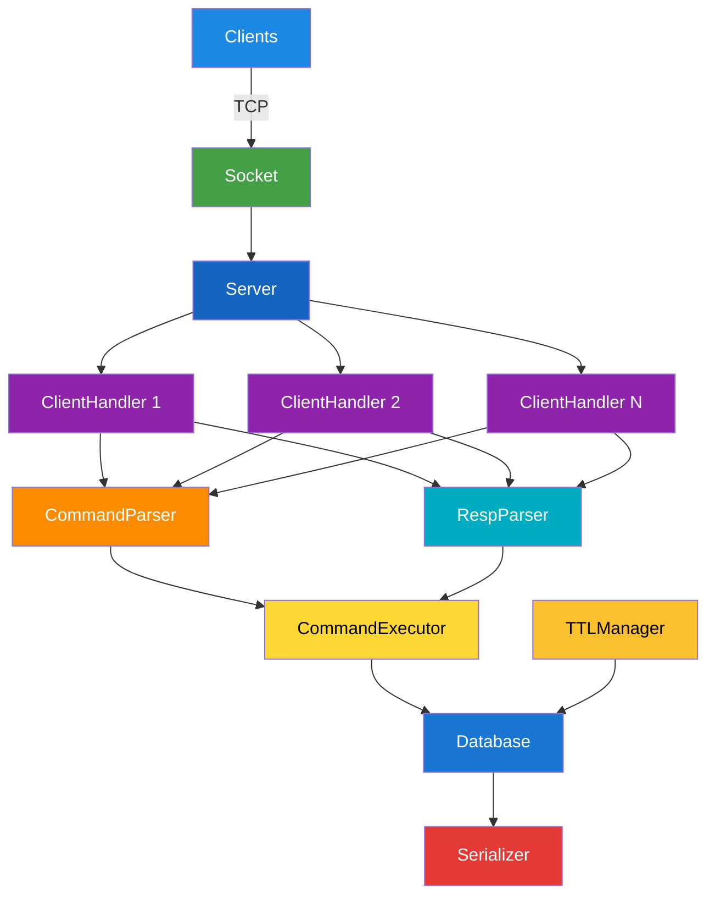
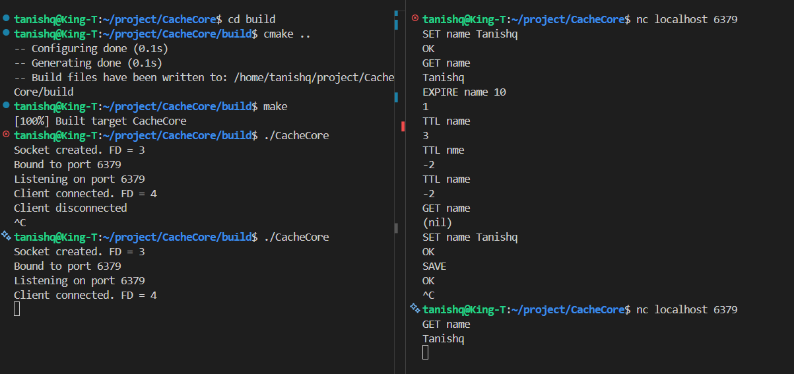

# CacheCore

A Redis-inspired, thread-safe in-memory key-value database built from scratch in modern C++20 with POSIX sockets, multithreading, TTL expiration, and snapshot persistence.


---

## Why CacheCore?

CacheCore was built to explore the core design principles behind in-memory databases. Instead of relying on existing libraries, it implements networking, concurrency, command execution, TTL management, and persistence from scratch using modern C++20.

---

## Overview

CacheCore is a lightweight Redis-inspired in-memory key-value database built to explore systems programming concepts such as:

- TCP socket programming
- Concurrent client handling
- Thread-safe shared data structures
- Key expiration (TTL)
- Binary snapshot persistence
- Modular C++ software architecture

The project focuses on understanding how an in-memory database works internally rather than replicating every Redis feature.

---

## Features

- 🚀 Multi-client TCP server
- ⚡ Thread-safe in-memory key-value database
- 📡 RESP request parsing support
- 🔒 Mutex-based synchronization
- ⏳ Lazy & active TTL expiration
- 💾 Binary snapshot persistence (SAVE/LOAD)
- 📦 Modular C++20 architecture
- 🛠 Built with CMake

---

## Supported Commands

| Command | Description |
|----------|-------------|
| SET key value | Store a key-value pair |
| GET key | Retrieve value |
| DEL key | Delete key |
| EXISTS key | Check if key exists |
| KEYS | List all keys |
| CLEAR | Remove all keys |
| EXPIRE key seconds | Set expiration |
| TTL key | Get remaining lifetime |
| SAVE | Persist database |
| LOAD | Restore database |
| PING | Health check |

---

## Time Complexity

| Operation | Average Complexity |
|-----------|-------------------:|
| SET | O(1) |
| GET | O(1) |
| DEL | O(1) |
| EXISTS | O(1) |
| EXPIRE | O(1) |
| TTL | O(1) |
| KEYS | O(n) |

---

## Architecture



---

## Project Structure

```
CacheCore
│
├── include/
│   ├── database/
│   ├── executor/
│   ├── parser/
│   ├── persistence/
│   ├── server/
│   ├── socket/
│   └── ttl/
│
├── src/
│   ├── database/
│   ├── executor/
│   ├── parser/
│   ├── persistence/
│   ├── server/
│   ├── socket/
│   └── ttl/
│
├── server/
│   └── main.cpp
│
├── CMakeLists.txt
├── README.md
└── LICENSE
```
---

### Lazy Expiration

Expired keys are removed when accessed.

---

### Active Expiration

A dedicated background thread periodically scans and removes expired entries.

---

### Persistence

CacheCore supports binary snapshot persistence.

- **SAVE** — Serializes the complete in-memory database to disk.
- **LOAD** — Restores the database state during server startup.

---

```
SAVE
```

Serializes the complete database to disk.

```
LOAD
```

Restores the database state during startup.

---

## Build

```bash
git clone https://github.com/Tanishq7361/CacheCore.git

cd CacheCore

mkdir -p build
cd build

cmake ..
make -j
```

---

## Run

```bash
./CacheCore
```

Server starts on

```
localhost:6379
```

---

## Example



---

## Technologies

- C++20
- POSIX Sockets
- TCP/IP
- Multithreading
- CMake
- STL
- std::unordered_map
- std::mutex
- Linux
  
---

## Future Improvements

- Full RESP response encoding
- redis-cli compatibility
- Additional Redis commands
- Unit tests
- Benchmarking
- Configurable persistence

---

## Key Learnings

- Low-level TCP socket programming
- Concurrent programming with std::thread and std::mutex
- Thread-safe shared state management
- In-memory database design
- TTL-based cache eviction
- Binary serialization and persistence
- Modular C++20 software architecture

---

## License

This project is licensed under the MIT License.

---

Built by **Tanishq Shah** to explore systems programming, networking, concurrency, and database internals using modern C++20.